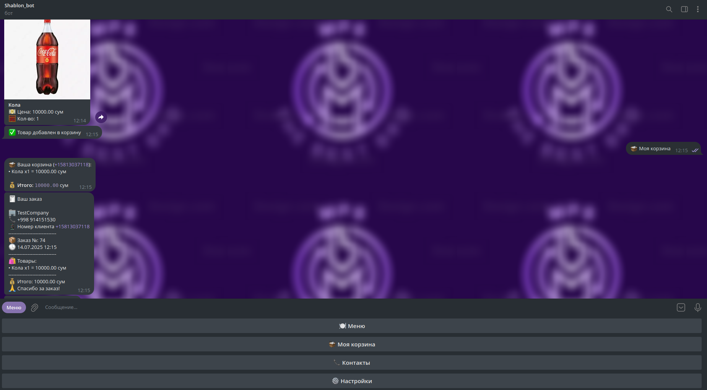
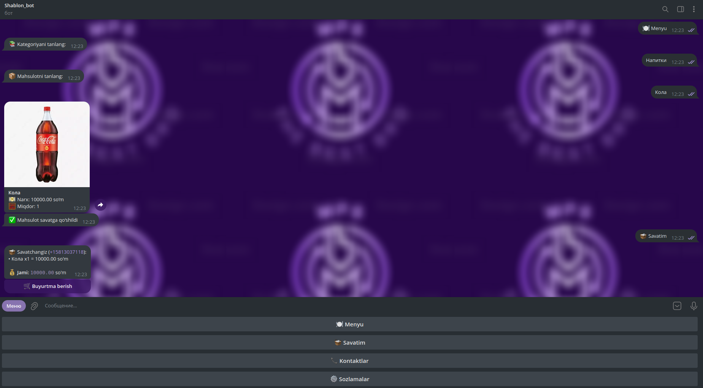
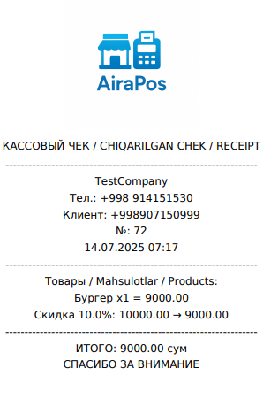

# 🍔 AIRA.BOT — Telegram-бот для доставки еды

**AIRA.BOT** — это умный Telegram-бот для быстрой и удобной доставки еды.  
Полная интеграция с Django API, локализация на 🇷🇺 Русский, 🇺🇿 Узбекский и 🇬🇧 Английский языки, поддержка скидок, заказов, корзины и других функций.

---

## 🚀 Возможности

- 📦 Выбор категорий и товаров
- 🛒 Интерактивная корзина с кнопками `➖ ➕`
- 📞 Запрос номера телефона
- 💬 Поддержка трёх языков (RU, UZ, EN)
- 🧾 Автоматическая генерация чека
- 🔐 FSM логика для управления заказом
- 🛍 Скидки и акции
- 🧑‍🍳 Панель компании на Django
- 📆 Учет подписки и рабочего времени

---

## 🖼️ Интерфейс

Скриншоты

| Язык         | Пример                                 |
|--------------|-----------------------------------------|
| 🇷🇺 Русский   |       |
| 🇺🇿 Узбекский |         |
| 🇬🇧 English   |       |
| 🧾 Чек        |     |

---

## ⚙️ Технологии

- [Aiogram 3.x](https://docs.aiogram.dev)
- [Django REST Framework](https://www.django-rest-framework.org/)
- PostgreSQL
- Docker & Docker Compose *(опционально)*
- `python-dotenv` для загрузки `.env`

---

## 📦 Установка

❌ **Установка недоступна**

> Этот код — **не предназначен для публичного использования или установки третьими лицами**.  
> Проект является **частным**, используется в боевом продукте и **не распространяется**.

**🚫 Запрещено:**

- Устанавливать и запускать бота на своих серверах
- Использовать код или его части без разрешения автора
- Распространять проект любым способом

🔒 Если вы заинтересованы в сотрудничестве или хотите аналогичного Telegram-бота —  
свяжитесь с автором: [@DeathTouchInto](https://t.me/DeathTouchInto)

---

## 📬 Автор

Разработано с ❤️ специально для автоматизации доставки еды.

- 🧑‍💻 **Telegram:** [@DeathTouchInto](https://t.me/DeathTouchInto)  
- 📧 **Email:** shahruzsharipov11@gmail.com *(чекаем иногда)*
